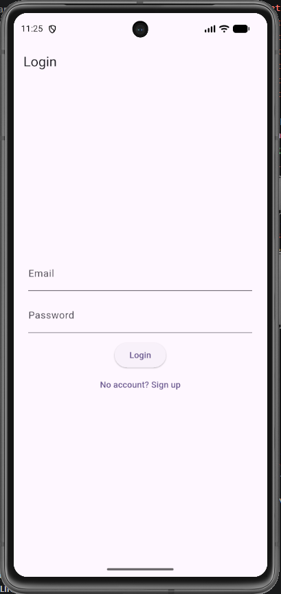
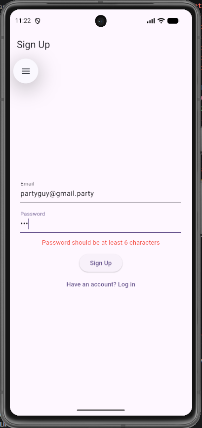
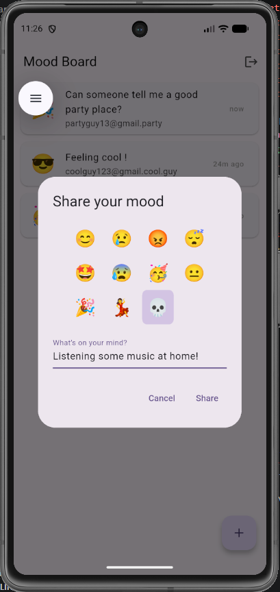
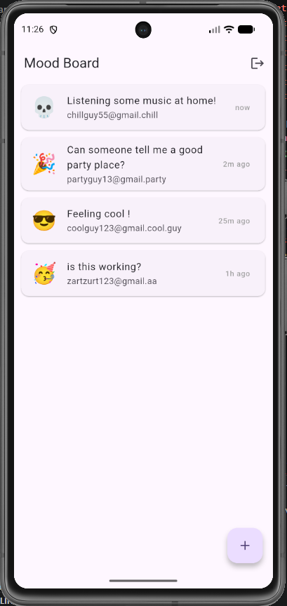

# Mood Board

A real-time mood sharing app built with Flutter, Firebase, and Riverpod. Sign up, share how you're feeling with an emoji and a note, and see everyone's moods update live — no refresh needed.

## Screenshot






## Features

- Email/password authentication (sign up, log in, log out)
- Share your mood with an emoji and a note
- Real-time feed — moods from all users appear instantly
- Relative timestamps ("5m ago", "2h ago")
- Automatic routing based on auth state

## Tech Stack

- **Flutter** (Dart 3)
- **Firebase Authentication** for user accounts
- **Cloud Firestore** for real-time data storage
- **Riverpod** for state management
- **MVVM architecture** (Model / Service / Notifier / View separation)

## Architecture

This project follows an MVVM-style structure:

- **Models** (`Mood`) — data shape and Firestore serialization
- **Services** (`AuthService`, `MoodService`) — Firebase communication
- **Providers/Notifiers** (`AuthController`, `MoodController`) — state and logic
- **Screens/Widgets** — UI only, listens to providers

## Project Structure

lib/
├── models/
│   └── mood.dart
├── services/
│   ├── auth_service.dart
│   └── mood_service.dart
├── providers/
│   ├── auth_provider.dart
│   └── mood_provider.dart
├── screens/
│   ├── auth_screen.dart
│   └── mood_board_screen.dart
├── widgets/
│   └── add_mood_dialog.dart
└── main.dart

## Getting Started

Make sure you have the [Flutter SDK](https://docs.flutter.dev/get-started/install) installed, plus an Android emulator or device.

1. Clone the repository:
```bash
   git clone https://github.com/rdagli97/mood_board.git
   cd mood_board
```
2. Install dependencies:
```bash
   flutter pub get
```
3. Set up your own Firebase project and run:
```bash
   flutterfire configure
```
   (This generates `firebase_options.dart` for your Firebase project.)
4. Enable **Email/Password** authentication and **Cloud Firestore** in the Firebase Console.
5. Run the app:
```bash
   flutter run
```

## What I Learned

This project was built to learn cloud backends and modern state management, including:

- Integrating Firebase Authentication and Cloud Firestore
- Real-time data with Firestore streams and Riverpod's `StreamProvider`
- Structuring an app with MVVM (separating UI, logic, and data)
- Managing async state (loading / error / data) with `AsyncValue.when`
- Cleaning up resources with `dispose`